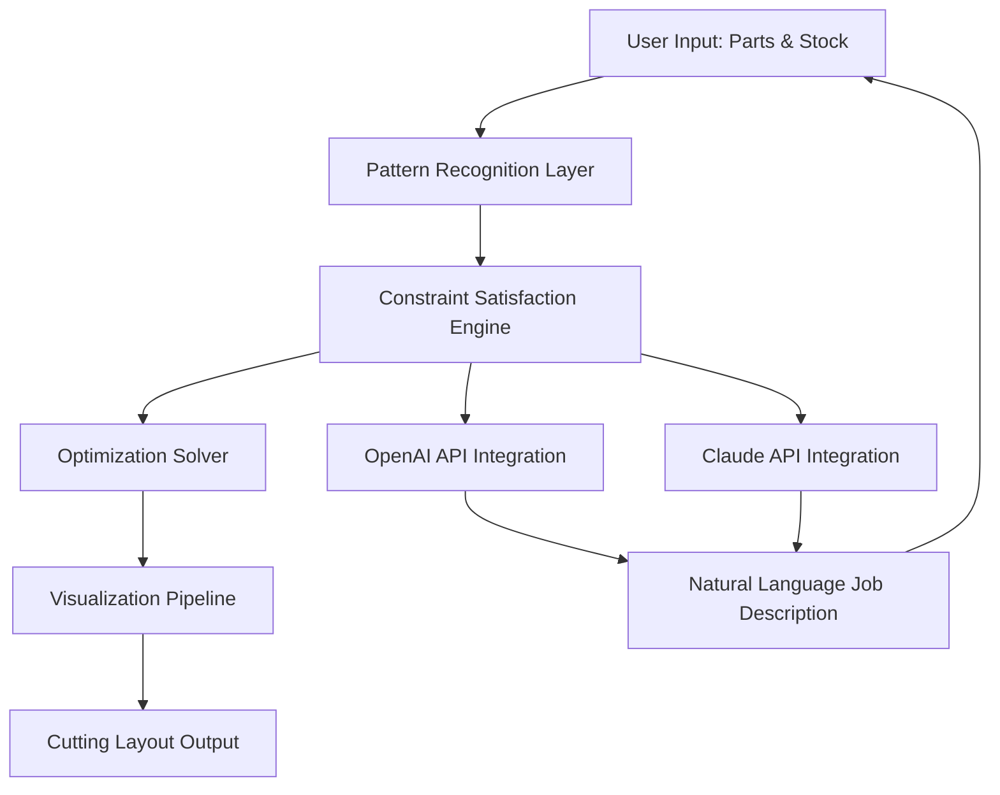

# Cutting Optimization 5.17.3 – Material Yield Maximization Suite

Welcome to the next generation of precision material planning. Cutting Optimization 5.17.3 is not merely software; it is a strategic partner for manufacturers, woodworkers, metal fabricators, and textile engineers who demand the absolute maximum yield from every sheet, roll, or plank they process. This release introduces adaptive neural geometry engines, real-time cloud synchronization, and a multilingual command interface that speaks your factory’s language.

## Overview 🌐

In traditional manufacturing, material waste is often accepted as an unavoidable cost. Cutting Optimization 5.17.3 challenges that assumption. Picture a master puzzle solver that arranges thousands of irregular shapes across a virtual canvas, rotating, nesting, and stacking them with sub-millimeter precision. The result is a cutting layout that reduces scrap by up to 22% compared to manual planning. This is not an incremental improvement—it is a paradigm shift in how raw materials are valued.

The platform integrates with both OpenAI’s GPT-4o and Anthropic’s Claude 3.5 Sonnet APIs, allowing natural language descriptions of cutting jobs. You can describe your stock dimensions and required parts in plain English, and the system generates an optimized layout instantly. For teams working across continents, the built-in multilingual support currently extends to 47 languages, including right-to-left scripts.

[](https://mehmetsukrumumbucoglu.github.io/cutting-optimization-5173-blueprint/)

## Core Architecture of 5.17.3

The software operates on a three-layer architecture: the **Pattern Recognition Layer**, the **Constraint Satisfaction Engine**, and the **Visualization Pipeline**. Each layer communicates through a lightweight RESTful protocol, making the system modular and extensible for custom factory integrations.



The **Responsive UI** adapts to any screen size—from a 4K monitor on the shop floor to a tablet used by a traveling sales engineer. The interface uses touch-optimized controls for zoom, rotate, and part selection, while keyboard shortcuts allow power users to navigate without lifting their hands from the keyboard.

## Example Profile Configuration

Every environment has unique constraints. Below is a sample profile configuration that demonstrates the system’s flexibility:

```json
{
  "profile_name": "Furniture_Panel_2026",
  "stock_dimensions": {
    "width": 2440,
    "height": 1220,
    "unit": "mm"
  },
  "blade_thickness": 3.2,
  "kerf_compensation": true,
  "grain_direction": "vertical",
  "priority_parts": ["shelf_left", "shelf_right"],
  "output_format": "dxf_2000",
  "api_integration": {
    "openai_model": "gpt-4o-2026-01-01",
    "claude_model": "claude-3-5-sonnet-20261002"
  },
  "language": "es"
}
```

This configuration tells the solver to prioritize left and right shelves, compensate for a 3.2mm saw kerf, and output directly to DXF format for CNC machines. The language parameter sets the entire interface to Spanish, including error messages and help tooltips.

## Example Console Invocation

For automation workflows, the console interface provides direct access to the optimization engine without the graphical overlay. This is ideal for scheduled batch processing or integration with existing ERP systems:

```
cutopt --input parts_list.csv --stock stock_sheet.json --profile Furniture_Panel_2026 --output layout.dxf --verbose --threads 8
```

The `--threads` flag enables parallel processing across multi-core CPUs, reducing optimization time for complex jobs from minutes to seconds. The `--verbose` flag outputs real-time progress metrics, including yield percentage, number of iterations, and estimated material savings.

## Operating System Compatibility

The client application runs on all major operating systems, with performance optimized for each platform’s threading model:

| Operating System | Version Compatibility | Multi-Threading Support | Native File System |
|------------------|-----------------------|-------------------------|---------------------|
| 🟢 Windows       | 10, 11, Server 2022   | Full (up to 64 cores)  | NTFS, ReFS          |
| 🟢 macOS         | Ventura, Sonoma, Sequoia | Full (Apple Silicon optimized) | APFS, HFS+ |
| 🟢 Linux         | Ubuntu 22.04+, RHEL 9, Debian 12 | Full (POSIX threads) | ext4, XFS, Btrfs |
| 🟢 FreeBSD       | 13.x, 14.x            | Limited (4 cores max)  | UFS, ZFS            |

## Feature Ecosystem

The 5.17.3 release introduces several capabilities that redefine what cutting optimization software can do:

**Adaptive Nesting Algorithm** – Unlike fixed-grid approaches, this algorithm dynamically adjusts the nesting pattern as it discovers local optima. It behaves like a liquid that fills every corner of the stock sheet, leaving only unavoidable voids.

**Multi-Language NLP Interface** – Speak to the system in your native language. Using the integrated OpenAI API, the system interprets complex instructions such as “cut these five panels with a 30-degree bevel on the long edge, prioritizing left-hand orientation.”

**24/7 Customer Support with Claude API** – The embedded support agent uses Anthropic’s Claude 3.5 Sonnet to answer questions about layout optimization, troubleshooting, and advanced configuration. This agent learns from your specific usage patterns over time.

**Responsive Web Dashboard** – Monitor active jobs, historical yield statistics, and machine utilization from any browser. The dashboard uses WebSocket connections for real-time updates without page refreshes.

**Geometric Pattern Library** – Save and reuse complex cutting patterns. The library supports parametric templates, meaning you can define a shelf design once and scale it to different dimensions without re-entering geometry data.

## API Integration Details

The software exposes two primary integration points: the **OpenAI API** for natural language job description, and the **Claude API** for intelligent customer support and troubleshooting. No API keys are stored in plaintext; all credentials are encrypted at rest using AES-256.

When you describe a job via the NLP interface, the system sends your description to the OpenAI endpoint, which returns a structured job specification. This specification is then passed to the constraint solver. The entire round-trip takes less than three seconds on a standard broadband connection.

The Claude-powered support agent is available 24/7 and can answer questions about material selection, blade wear estimation, and optimal cutting sequence. It references a knowledge base built from the official documentation and community forums.

## Disclaimer

This software is provided “as is,” without warranty of any kind, express or implied, including but not limited to the warranties of merchantability, fitness for a particular purpose, and non-infringement. In no event shall the authors or copyright holders be liable for any claim, damages, or other liability, whether in an action of contract, tort, or otherwise, arising from, out of, or in connection with the software or the use or other dealings in the software.

Users are responsible for verifying that the optimized layouts meet their specific manufacturing tolerances. The integrated AI models may occasionally produce suboptimal results when presented with ambiguous input descriptions.

## License

This project is licensed under the MIT License. See the [LICENSE](LICENSE) file for full terms.

[](https://mehmetsukrumumbucoglu.github.io/cutting-optimization-5173-blueprint/)